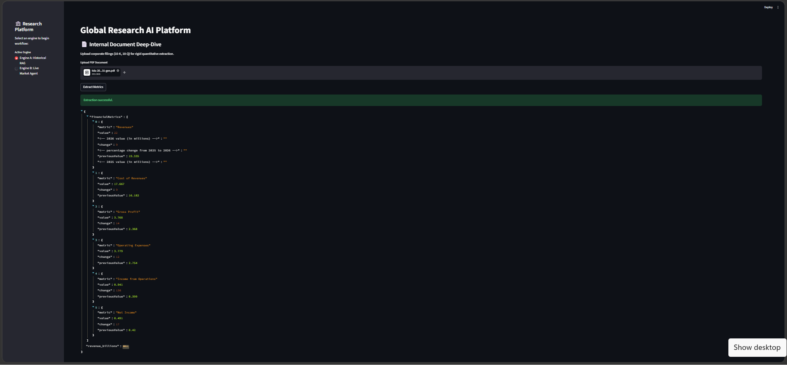
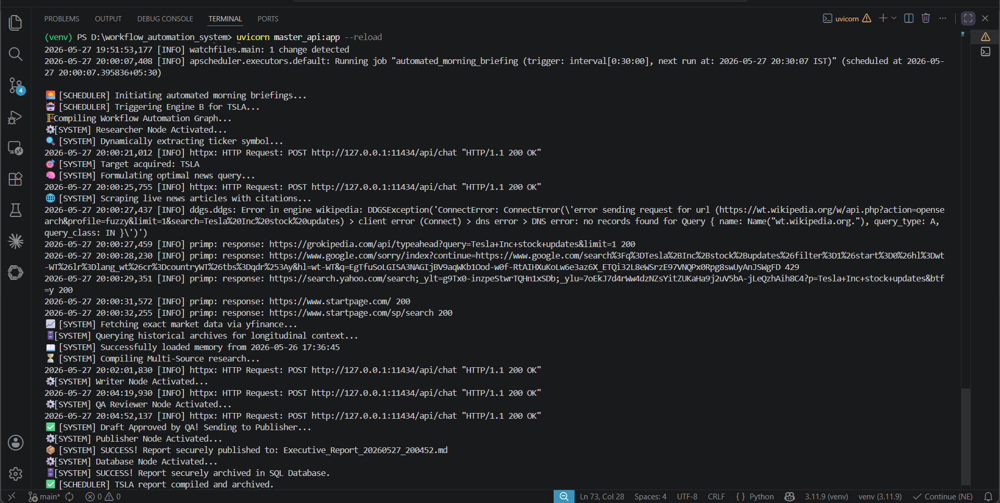

# 🌐 Global Research AI Platform
**Autonomous Quantitative Analysis & Workflow Automation Engine**

An enterprise-grade, asynchronous AI architecture designed to automate institutional market research. This platform synthesizes real-time market data, qualitative news sentiment, and historical longitudinal memory into verifiable, citation-backed executive briefings.

---
An enterprise-grade, asynchronous AI architecture designed to automate institutional market research. This platform synthesizes real-time market data, qualitative news sentiment, and historical longitudinal memory into verifiable, citation-backed executive briefings.

<div align="center">
  
</div>

---

## 🏗️ System Architecture

The platform operates on a decoupled, microservice-inspired architecture, separating the client-side UI from a heavy-lifting FastAPI backend to ensure non-blocking execution during complex LLM routing.

### 🧠 Dual-Engine Routing
* **Engine A: Internal RAG (Archival)** * Ingests, chunks, and vectorizes proprietary financial documents (10-K, 10-Q).
    * Executes strict semantic search over internal knowledge bases (Hardware-optimized with `k=5` chunking to prevent local OOM bottlenecks).
* **Engine B: Live Market Agent (Agentic Workflow)**
    * Built on **LangGraph** for autonomous tool-calling and state management.
    * Fetches real-time price action via `yfinance`.
    * Scrapes live market sentiment via `DuckDuckGoSearchResults`.
    * **Memory Layer:** Queries an internal SQLite database (`global_research_center.db`) to retrieve past reports and perform longitudinal delta analysis (e.g., price shifts, sentiment changes over time).

---

## 🚀 Key Enterprise Features

1.  **Asynchronous Job Queue:** The FastAPI backend utilizes background task processing. The UI polls the server for completion, completely preventing timeout errors during 60+ second agentic workflows.
2.  **Source Attribution Engine:** Hallucination prevention is hardcoded. The agent is forced to extract raw HTTP URLs from its search tools and append a "Sources Cited" section to every brief.
3.  **Longitudinal Reasoning (Memory):** Unlike stateless chatbots, Engine B queries previous runs from the database to explicitly compare today's live data against historical context, highlighting market shifts.
4.  **Event-Driven Automation:** Integrated `APScheduler` for proactive cron-job reporting. The engine wakes up autonomously, scrapes data, and archives fully cited pre-market briefings without human intervention.

<div align="center">
  
</div>

---

---

## 🛠️ Tech Stack

* **Backend API:** FastAPI, Uvicorn, Python 3.10+
* **Frontend UI:** Streamlit (Async Polling)
* **AI & Orchestration:** LangGraph, LangChain, Ollama (Llama 3 / Phi-3)
* **Data & Memory:** SQLite, yfinance, DuckDuckGo API
* **Version Control:** Git / GitHub CLI

---

## 📂 Project Structure

```text
Global-Research-AI-Platform/
├── master_api.py                  # FastAPI Backend, Lifespan Manager & APScheduler
├── master_app.py                  # Streamlit UI & Session State Logic
├── config.py                      # Environment variables & Shared Config
├── database.py                    # SQLite connection pooling & initialization
├── global_research_center.db      # (Git-Ignored) Local Memory Storage
├── external_agent_engine/         # Engine B: Live Market Agent
│   ├── graph.py                   # LangGraph state machine routing
│   ├── graph_state.py             # Type definitions & State schema
│   └── nodes.py                   # Tool execution, memory retrieval, & LLM prompts
└── internal_rag_engine/           # Engine A: Vector Database Retrieval
    ├── main.py                    # PDF Ingestion & Pipeline execution
    └── retriever.py               # Semantic search and hardware-optimized chunking

⚙️ Local Setup & Installation
1. Prerequisites
Ensure you have Python 3.10+ installed and Ollama running locally.
Pull your preferred local model (default is Llama 3):

```bash
ollama run llama3
```

2. Clone & Install
```bash
git clone https://github.com/padmabhushanpagare/global_research_ai_platform.git
cd global_research_ai_platform
python -m venv venv
source venv/bin/activate  # On Windows: venv\Scripts\activate
pip install -r requirements.txt
```
⚡ Execution Protocol
Because of the decoupled architecture, the Backend API and the Frontend UI must be run as separate microservices.

Terminal 1: Boot the AI Engine & Scheduler
This initiates the FastAPI server and starts the APScheduler background clock for automated daily briefings.
```bash
uvicorn master_api:app --reload
```

Expected Output: ⏱️ [SYSTEM] Booting Event-Driven Scheduler...

Terminal 2: Boot the Client UI
```bash
streamlit run master_app.py
```

Navigate to http://localhost:8501. Select your engine, input a target asset (e.g., TSLA), and execute the pipeline.

🗺️ Roadmap / Future Architecture

-[ ] Cloud Migration: Containerize services via Docker for deployment on AWS ECS.

-[ ] LLMOps Integration: Implement LangSmith tracing for visual agent trajectory monitoring and token latency tracking.

-[ ] Expanded Toolset: Integrate SEC EDGAR API for live 8-K/10-K scraping to supplement yfinance quantitative data.